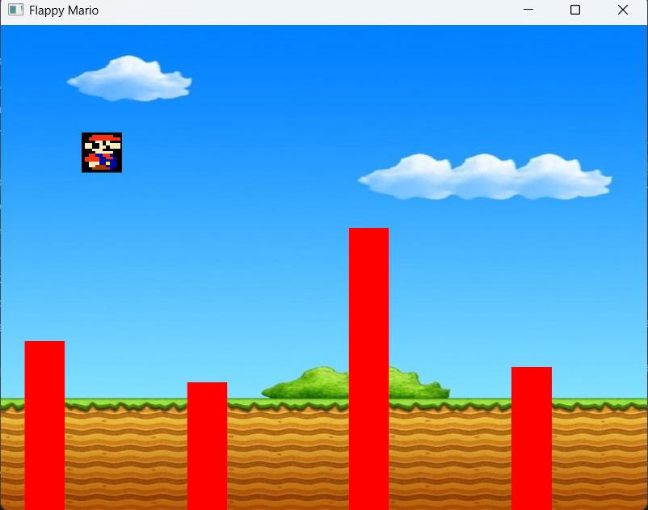
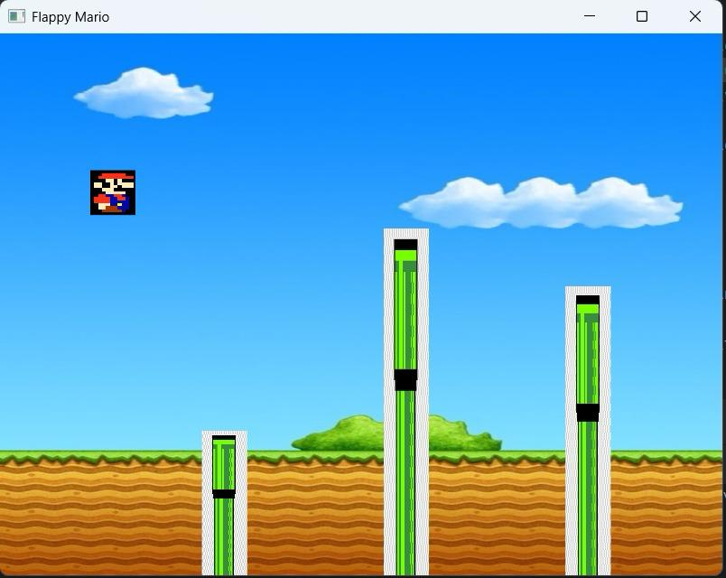
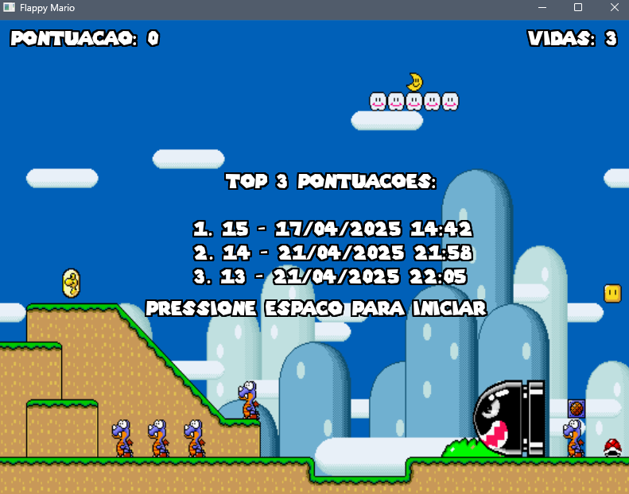
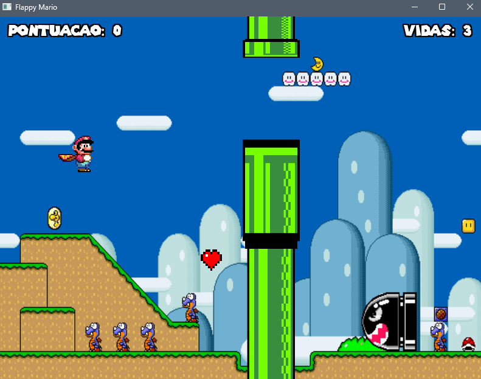
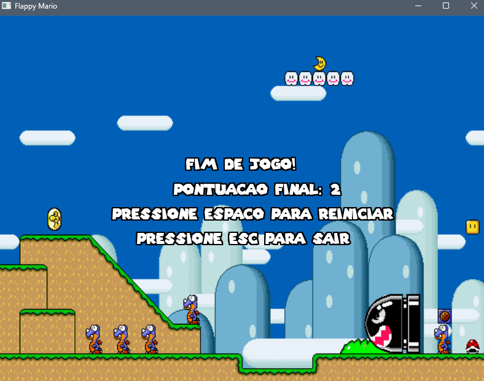

# Flappy Mario
 Projeto de jogo 2D no estilo Flappy Bird com texturas de Super Mario World, desenvolvido para a disciplina de Computação Gráfica.

## Como jogar
- Pressione espaço para fazer o Mario passar os obstáculos
- Cada obstáculo ultrapassado soma um ponto no score
- Pressione ESC para finalizar o jogo

## Telas






## Requisitos
- Utilize Python 3.10+
- Pip

## Dependências
O projeto utiliza as bibliotecas:
- glfw
- PyOpenGL
- Pillow

## Como rodar o Flappy Mario

### 🐧 Linux
**Clone o repositório**
```
git clone https://github.com/caiokirst/FlappyMario.git
cd FlappyMario
```
**Instale as dependências**
```
pip install -r requirements.txt
```
**Execute o jogo**
```
python main.py
```

### 🪟 Windows
**Clone o repositório ou baixe o ZIP e extraia**
```
git clone https://github.com/caiokirst/FlappyMario.git
cd FlappyMario
```
**Instale as dependências**
```
pip install -r requirements.txt
```
**Execute o jogo**
```
python main.py
```
